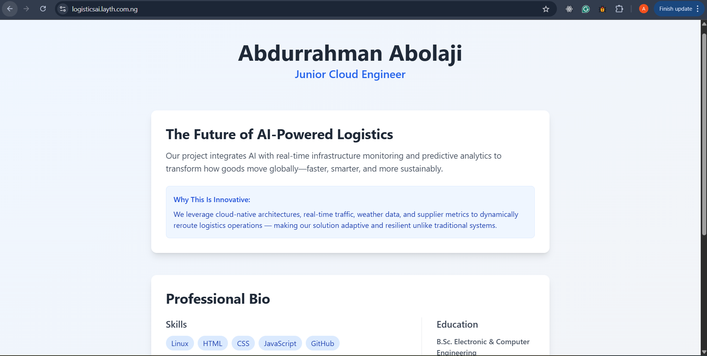

# AI-Powered Logistics - Landing Page

This is a dynamic, responsive landing page project for showcasing **"The Future of AI-Powered Logistics"** by Abdurrahman Abolaji. It is built with Node.js, Express, EJS templates, Tailwind CSS, and includes a systemd service and Nginx reverse proxy setup for production deployment.

---

## Ì≤ª Technologies Used

- Node.js + Express
- EJS Templating
- Tailwind CSS
- systemd
- Nginx
- AWS EC2 (Ubuntu 24.04)

---

## Ì≥¶ Project Setup & Deployment

This section outlines the full process followed to build, deploy, and serve the AI-Powered Logistics landing page on a live domain using Node.js, Nginx, and AWS EC2.

---

### ‚úÖ 1. EC2 Instance Provisioning

- Launched an **Ubuntu 24.04 (Noble Numbat)** instance on AWS EC2 using the **`t3.micro` free tier**.
- Specs:
  - **8GB** Storage
  - **1GB RAM**
  - **2 vCPUs**
- Security group was configured to allow inbound traffic on:
  - **Port 22 (SSH)**
  - **Port 80 (HTTP)**
  - **Port 443 (HTTPS)**

---

### ⚙️ 2. Installed Dependencies on the Server

After SSH-ing into the EC2 instance, the following packages were installed:

```bash
sudo apt update && sudo apt install -y nginx nodejs npm certbot python3-certbot-nginx unzip
```

Additionally, installed project-specific Node.js dependencies:

```bash
npm install express ejs
```

---

### Ì≤ª 3. Copied and Tested the App

- Built and tested the app locally to ensure everything worked.
- Copied the project files to the server using `scp`.
- Manually ran the app with:

```bash
node app.js
```

- Initially, the app wasn't accessible due to EC2's default firewall. So, **Port 3000** was added to the EC2 inboud security group to allow HTTP testing.

---

### ̥Š4. Nginx Reverse Proxy Configuration

Created a reverse proxy config at:

```bash
/etc/nginx/conf.d/logisticsAI.conf
```

**Contents:**
```nginx
server {
    listen 80;
    server_name 13.60.173.12;

    location / {
        proxy_pass http://localhost:3000;
        proxy_http_version 1.1;
        proxy_set_header Upgrade $http_upgrade;
        proxy_set_header Connection 'upgrade';
        proxy_set_header Host $host;
        proxy_cache_bypass $http_upgrade;
    }
}
```

- Ran `sudo nginx -t` to test, then `sudo nginx -s reload`.
- Page was now accessible via server IP.

---

### ̪°Ô∏è 5. Created a systemd Service

To ensure the app runs on boot and stays alive, created a service at:

```bash
/etc/systemd/system/logisticsAI.service
```

**Contents:**
```ini
[Unit]
Description=Node.js App - logisticsAI
After=network.target

[Service]
ExecStart=/usr/bin/node /var/www/html/logisticsAI/app.js
Restart=always
User=www-data
Environment=NODE_ENV=production
WorkingDirectory=/var/www/html/logisticsAI

[Install]
WantedBy=multi-user.target

```

**Enabled it:**
```bash
sudo systemctl daemon-reload
sudo systemctl enable logisticsAI.service
sudo systemctl start logisticsAI.service
```

---

### ̺ê 6. Domain Name + DNS Setup

- Used an existing domain from [Whogohost](https://whogohost.com).
- Created **A records** for:
  - `logisticsai.layth.com.ng`
  - `www.logisticsai.layth.com.ng`
- Both pointed to the **EC2 public IP address**.

---

### Ì¥í 7. HTTPS Setup with Certbot

Ran Certbot to auto-configure SSL for both domains:

```bash
sudo certbot --nginx -d logisticsai.layth.com.ng -d www.logisticsai.layth.com.ng
```
**Contents:**
```nginx
server {
    server_name logisticsai.layth.com.ng www.logisticsai.layth.com.ng;

    location / {
        proxy_pass http://localhost:3000;
        proxy_http_version 1.1;
        proxy_set_header Upgrade $http_upgrade;
        proxy_set_header Connection 'upgrade';
        proxy_set_header Host $host;
        proxy_cache_bypass $http_upgrade;
    }

    listen 443 ssl; # managed by Certbot
    ssl_certificate /etc/letsencrypt/live/logisticsai.layth.com.ng/fullchain.pem; # managed by Certbot
    ssl_certificate_key /etc/letsencrypt/live/logisticsai.layth.com.ng/privkey.pem; # managed by Certbot
    include /etc/letsencrypt/options-ssl-nginx.conf; # managed by Certbot
    ssl_dhparam /etc/letsencrypt/ssl-dhparams.pem; # managed by Certbot


}

server {
    if ($host = www.logisticsai.layth.com.ng) {
        return 301 https://$host$request_uri;
    } # managed by Certbot


    if ($host = logisticsai.layth.com.ng) {
        return 301 https://$host$request_uri;
    } # managed by Certbot


    listen 80;
    server_name logisticsai.layth.com.ng www.logisticsai.layth.com.ng;
    return 404; # managed by Certbot

}
```

- Certbot modified the Nginx config and reloaded it.
- HTTPS now active with automatic renewal support.

---

### Ì∑ÇÔ∏è 8. GitHub Deployment

Created a GitHub repository on github.com, then cloned the repo to my machine.:

```bash
git clone git@github.com:Abdurrahman-X/LogisticsAI.git
git add .
git commit -m "Initial commit"
git push -u origin main
```

---

## ̺ç Live Demo

**URL:**  
[https://logisticsai.layth.com.ng](https://logisticsai.layth.com.ng)

---

## Ì≥∏ Screenshot




---

## Ì≥´ Contact

**Name:** Abdurrahman Abolaji  
**Email:** abolajiabdurrahman@gmail.com
